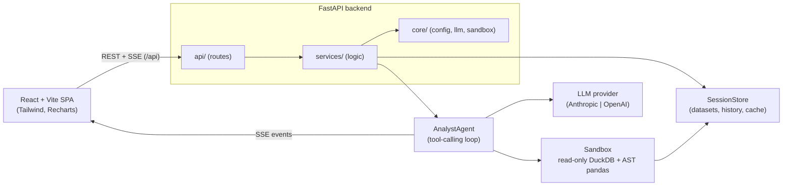

# AI Data Analyst (DataPilot)

Upload CSVs and chat with your data in natural language. Ask a question, and the
agent inspects the schema, writes SQL or pandas, runs it in a hardened sandbox, and
answers with tables, charts, and anomaly highlights — all streamed to the browser.

> The LLM never touches your filesystem directly. Every generated query is validated
> and executed read-only, with time and row limits.

## Features

- **Chat with tabular data** — natural-language questions over one or many CSVs.
- **Streaming answers** — Server-Sent Events carry status, tool calls, charts, and the
  final answer as the agent works.
- **Auto-generated charts** — bar / line / area / pie / scatter / histogram specs
  rendered with Recharts, exportable to PNG.
- **Anomaly detection** — z-score, IQR, and IsolationForest; flagged rows are highlighted.
- **Data profiling & quality** — per-column stats, quality score, null/duplicate/outlier
  summary surfaced in the Inspector.
- **Multi-file joins** — upload related CSVs and query across them with DuckDB.
- **Safe by construction** — read-only DuckDB, AST-validated pandas, timeouts, row caps.

## Architecture



**Layers** (backend): `api/` → `services/` → `core/`. Routes stay thin; all business
logic lives in services; config, LLM access, and sandboxing live in core.

## Tech stack

| Area      | Choices |
|-----------|---------|
| Backend   | FastAPI, Python 3.11, pandas, DuckDB, pydantic v2, sqlglot, scikit-learn |
| LLM       | Anthropic (default) or OpenAI, behind a provider interface |
| Frontend  | React 18, Vite, TypeScript (strict), Tailwind CSS, Recharts, TanStack Query |
| Testing   | pytest (backend), ruff + mypy, eslint |
| Packaging | Docker, docker compose, GitHub Actions |

## Quickstart

### Docker (recommended)

```bash
cp backend/.env.example backend/.env     # add your ANTHROPIC_API_KEY
docker compose up --build               # http://localhost:3000
```

The frontend is served by nginx on **:3000** and proxies `/api` to the backend on :8000.

### Local development

```bash
# backend
cd backend
python -m venv .venv && .venv\Scripts\activate     # source .venv/bin/activate on Unix
pip install -r requirements.txt
cp .env.example .env                                # add your API key
uvicorn app.main:app --reload                       # http://localhost:8000

# frontend (new terminal)
cd frontend
npm install
npm run dev                                          # http://localhost:5173
```

The Vite dev server proxies `/api` to `http://localhost:8000`, so no CORS setup is needed.

## Environment variables

See `backend/.env.example` for the full list. Key ones:

| Variable | Default | Purpose |
|----------|---------|---------|
| `LLM_PROVIDER` | `anthropic` | `anthropic` or `openai` |
| `ANTHROPIC_API_KEY` / `OPENAI_API_KEY` | — | Provider credentials (env only) |
| `ANTHROPIC_MODEL` | `claude-sonnet-4-5` | Model id |
| `CORS_ORIGINS` | localhost origins | Comma-separated allowed origins |
| `SQL_TIMEOUT_SECONDS` | `10` | Per-query SQL timeout |
| `PANDAS_TIMEOUT_SECONDS` | `10` | Per-snippet pandas timeout |
| `MAX_RESULT_ROWS` | `10000` | Row cap on any result |
| `MAX_UPLOAD_BYTES` | `26214400` | Per-file upload cap (25 MB) |
| `RATE_LIMIT_PER_MINUTE` | `60` | Per-IP request limit |
| `AGENT_MAX_ITERATIONS` | `6` | Max tool-calling loop depth |

Frontend: `VITE_API_URL` (empty = same origin, the default for Docker).

## API

| Method | Path | Description |
|--------|------|-------------|
| `GET` | `/api/health` | Liveness + provider/config status |
| `POST` | `/api/sessions` | Create a session |
| `GET` | `/api/sessions/{id}` | Get a session |
| `DELETE` | `/api/sessions/{id}` | Delete a session |
| `POST` | `/api/sessions/{id}/files` | Upload one or more CSVs (multipart) |
| `GET` | `/api/sessions/{id}/files` | List datasets + profiles |
| `DELETE` | `/api/sessions/{id}/files/{file_id}` | Remove a dataset |
| `GET` | `/api/sessions/{id}/inspector` | Quality reports, query history, pinned charts |
| `POST` | `/api/sessions/{id}/chat` | **SSE** chat stream |
| `POST` | `/api/sessions/{id}/chat/sync` | Non-streaming chat (JSON) |

SSE event types: `status`, `tool_call`, `chart`, `anomaly`, `final`, `error`.

## Sample data & questions

`samples/` (or `sample_data/`) ships three related CSVs — `sales.csv` (2,000 rows,
seeded anomalies), `customers.csv`, `products.csv` — and the app serves them as one-click
sample datasets. Try:

1. Which region generated the highest revenue?
2. Show the monthly revenue trend as a line chart.
3. Top 5 customers by revenue.
4. Detect anomalies in revenue.
5. Join sales with customers and break revenue down by tier.
6. Which products have the highest margin, and how do they perform?

## Testing & quality

```bash
# backend
cd backend
python -m pytest        # 80 tests
ruff check . && mypy app
ruff format .

# frontend
cd frontend
npm run lint
npm run build
```

CI (`.github/workflows/ci.yml`) runs ruff, mypy, and pytest for the backend, and eslint
plus a production build for the frontend on every push and PR.

## Design decisions

- **Read-only DuckDB per session.** Uploaded DataFrames are registered as views on a
  session-scoped connection; the connection is opened read-only and never exposes the
  filesystem. Registered views live on the connection, so queries run there directly.
- **AST-validated pandas.** `run_pandas` parses the snippet and rejects imports, dunders,
  `open/exec/eval`, and filesystem-accessing pandas attributes before running it in a
  spawned worker process with a wall-clock timeout.
- **sqlglot validation.** Only a single `SELECT`/`WITH` survives; DDL/DML, `PRAGMA`,
  `COPY`, `ATTACH`, `INSTALL`, `LOAD`, and file-reading table functions are rejected.
- **Provider abstraction.** All model calls flow through `core/llm.py`; swapping
  Anthropic ↔ OpenAI (or a mock in tests) is a one-line config change.
- **SSE over POST.** Browsers' `EventSource` cannot POST, so the client streams the
  response body of a `fetch` request and parses `event:`/`data:` frames, with a
  synchronous endpoint as a fallback.
- **Result caching.** Identical SQL within a session is served from an LRU cache.

## Project structure

```
backend/
  app/
    api/        # routes (thin)
    services/   # ingest, session store, agent, quality
    core/       # config, llm, sandbox, logging, errors
    models/     # pydantic schemas
  tests/
  scripts/      # sample-data generator
  Dockerfile
frontend/
  src/
    api/        # typed REST client
    components/ # ui, chat, charts, datasets, layout
    hooks/      # chat stream, datasets, session, inspector
    pages/      # styleguide (#/styleguide)
  Dockerfile, nginx.conf
sample_data/    # generated CSVs
docker-compose.yml
```

## Security notes

- API keys are read from environment variables only and never logged or committed.
- Uploads are size-capped, restricted to CSV, and profiled with encoding detection.
- Generated SQL and pandas never run unsandboxed; failures are fed back to the agent for
  self-correction instead of crashing the request.
- Sessions are in-memory and per-process — suitable for a demo, not multi-node scale.

## Assumptions & limitations

- Single-process, in-memory session store (no persistence, no cross-worker sharing).
- Rate limiting is in-memory per process.
- The LLM tool loop is capped at `AGENT_MAX_ITERATIONS`; extremely complex asks may need
  to be broken down.
- CSV only for now; Excel/Parquet are natural next steps.
