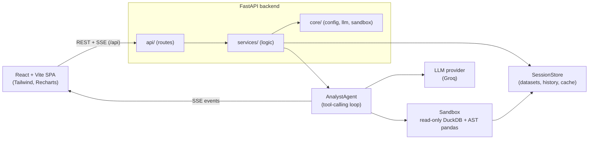

# AI Data Analyst (DataPilot)

Upload CSVs and chat with your data in natural language. Ask a question, and the
agent inspects the schema, writes SQL or pandas, runs it in a hardened sandbox, and
answers with tables, charts, and anomaly highlights — all streamed to the browser.

> The LLM never touches your filesystem directly. Every generated query is validated
> and executed read-only, with time and row limits.

## Features

- **Chat with tabular data** — natural-language questions over one or many CSVs.
- **Streaming answers** — Server-Sent Events carry status, tool calls, charts, and the
  final answer as the agent works.
- **Auto-generated charts** — bar / line / area / pie / scatter / histogram specs
  rendered with Recharts, exportable to PNG.
- **Anomaly detection** — z-score, IQR, and IsolationForest; flagged rows are highlighted.
- **Data profiling & quality** — per-column stats, quality score, null/duplicate/outlier
  summary surfaced in the Inspector.
- **Multi-file joins** — upload related CSVs and query across them with DuckDB.
- **Safe by construction** — read-only DuckDB, AST-validated pandas, timeouts, row caps.

## Architecture



**Layers** (backend): `api/` → `services/` → `core/`. Routes stay thin; all business
logic lives in services; config, LLM access, and sandboxing live in core.

## Tech stack

| Area      | Choices |
|-----------|---------|
| Backend   | FastAPI, Python 3.11, pandas, DuckDB, pydantic v2, sqlglot, scikit-learn |
| LLM       | Groq (OpenAI-compatible; `openai/gpt-oss-120b` default), behind a provider interface |
| Frontend  | React 18, Vite, TypeScript (strict), Tailwind CSS, Recharts, TanStack Query |
| Testing   | pytest (backend), ruff + mypy, eslint |
| Tooling   | GitHub Actions (CI), Makefile, cross-platform dev runner |

## Quickstart

### Docker Compose

Docker is the quickest way to run the production frontend and API together. From a
clean clone, run:

```bash
docker compose up --build
```

Open <http://localhost:3000>; the frontend proxies `/api` to the backend. The API is
also available at <http://localhost:8000> and its liveness endpoint at
<http://localhost:8000/api/health>. Compose uses `backend/.env.example` as its default
environment file, so the stack boots without credentials; add a real
`GROQ_API_KEY` to `backend/.env` for live analysis. Compose loads that optional file
after the example file, so your values override the defaults.

To verify both services after startup:

```bash
curl http://localhost:8000/api/health
curl -I http://localhost:3000/
```

Stop the stack with `docker compose down`.

### One command

```bash
# from the repo root, after installing dependencies (see below)
node scripts/dev.mjs     # or: make dev
```

This starts the backend on **:8000** and the frontend on **:5173** with prefixed logs;
`Ctrl+C` stops both.

### Manual setup

```bash
# backend
cd backend
python -m venv .venv && .venv\Scripts\activate     # source .venv/bin/activate on Unix
pip install -r requirements.txt
cp .env.example .env                                # add your API key
uvicorn app.main:app --reload                       # http://localhost:8000

# frontend (new terminal)
cd frontend
npm install
npm run dev                                          # http://localhost:5173
```

The Vite dev server proxies `/api` to `http://localhost:8000`, so no CORS setup is needed.

### Production build (local)

```bash
cd frontend
npm run build
npm run preview        # http://localhost:4173, proxies /api to :8000
```

`vite preview` also proxies `/api` to the backend, so the built SPA runs without a
reverse proxy. For a real deployment, serve `frontend/dist` behind any static host and
point `/api` at the backend (set `VITE_API_URL` if the API lives on another origin).

## Environment variables

`backend/.env.example` documents every backend setting. Its matching variable names
are loaded case-insensitively by Pydantic Settings:

| Variable | Default | Purpose |
|----------|---------|---------|
| `LLM_PROVIDER` | `groq` | LLM provider |
| `GROQ_API_KEY` | — | Groq API key (env only) |
| `GROQ_MODEL` | `openai/gpt-oss-120b` | Groq model id (must support tool calling) |
| `GROQ_BASE_URL` | `https://api.groq.com` | Groq API base (SDK appends `/openai/v1`) |
| `CORS_ORIGINS` | localhost origins | Comma-separated allowed origins |
| `SQL_TIMEOUT_SECONDS` | `10` | Per-query SQL timeout |
| `PANDAS_TIMEOUT_SECONDS` | `10` | Per-snippet pandas timeout |
| `MAX_RESULT_ROWS` | `10000` | Row cap on any result |
| `MAX_UPLOAD_BYTES` | `26214400` | Per-file upload cap (25 MB) |
| `RATE_LIMIT_PER_MINUTE` | `60` | Per-IP request limit |
| `AGENT_MAX_ITERATIONS` | `6` | Max tool-calling loop depth |
| `APP_NAME` | `AI Data Analyst` | FastAPI title |
| `ENVIRONMENT` | `development` | Deployment environment label |
| `DEBUG` | `false` | Debug flag |
| `LOG_LEVEL` | `INFO` | Application log level |
| `LLM_MAX_TOKENS` | `4096` | Maximum generated tokens |
| `GROQ_BASE_URL` | `https://api.groq.com` | Groq-compatible API base |
| `MAX_FILES_PER_SESSION` | `20` | Upload count cap per session |
| `MAX_ROWS_PROFILED` | `200000` | Maximum rows profiled per dataset |
| `SAMPLE_ROWS` | `5` | Rows included in schema samples |
| `PANDAS_TIMEOUT_SECONDS` | `10` | Restricted pandas execution timeout |
| `MAX_QUERY_CACHE` | `128` | Session query-cache size |
| `MEMORY_TOKEN_BUDGET` | `8000` | Conversation and tool context budget |
| `TOOL_RESULT_BUDGET_CHARS` | `6000` | Maximum LLM-facing tool-result size |
| `LLM_RESULT_ROWS` | `50` | Rows retained in LLM-facing query results |

Frontend: `VITE_API_URL` (empty = same origin; the Vite dev/preview servers proxy `/api`
to port 8000). Set it only when the API is served from a different origin.

## API

| Method | Path | Description |
|--------|------|-------------|
| `GET` | `/api/health` | Liveness + provider/config status |
| `POST` | `/api/sessions` | Create a session |
| `GET` | `/api/sessions/{id}` | Get a session |
| `DELETE` | `/api/sessions/{id}` | Delete a session |
| `POST` | `/api/sessions/{id}/files` | Upload one or more CSVs (multipart) |
| `GET` | `/api/sessions/{id}/files` | List datasets + profiles |
| `DELETE` | `/api/sessions/{id}/files/{file_id}` | Remove a dataset |
| `GET` | `/api/sessions/{id}/inspector` | Quality reports, query history, pinned charts |
| `POST` | `/api/sessions/{id}/chat` | **SSE** chat stream |
| `POST` | `/api/sessions/{id}/chat/sync` | Non-streaming chat (JSON) |

SSE event types: `status`, `tool_call`, `chart`, `anomaly`, `final`, `error`.

## Sample data & questions

`samples/` (or `sample_data/`) ships three related CSVs — `sales.csv` (2,000 rows,
seeded anomalies), `customers.csv`, `products.csv` — and the app serves them as one-click
sample datasets. Try:

1. Which region generated the highest revenue?
2. Show the monthly revenue trend as a line chart.
3. Top 5 customers by revenue.
4. Detect anomalies in revenue.
5. Join sales with customers and break revenue down by tier.
6. Which products have the highest margin, and how do they perform?

## Testing & quality

```bash
# backend
cd backend
python -m pytest        # 80 tests
ruff check . && mypy app
ruff format .

# frontend
cd frontend
npm run lint
npm run build
```

CI (`.github/workflows/ci.yml`) runs ruff, mypy, and pytest for the backend, and eslint
plus a production build for the frontend on every push and PR.

Run the six README prompts against a running API (with a configured LLM key) using
`make eval`. Set `DATAPILOT_API_URL` to target a different API URL.

## Demo assets

**Screenshots:** _Placeholder — add product screenshots here._

**Demo video:** _Placeholder — add a demo video link here._

**Live demo:** _Placeholder — add a deployed application link here._

## Design decisions

- **Read-only DuckDB per session.** Uploaded DataFrames are registered as views on a
  session-scoped connection; the connection is opened read-only and never exposes the
  filesystem. Registered views live on the connection, so queries run there directly.
- **AST-validated pandas.** `run_pandas` parses the snippet and rejects imports, dunders,
  `open/exec/eval`, and filesystem-accessing pandas attributes before running it in a
  spawned worker process with a wall-clock timeout.
- **sqlglot validation.** Only a single `SELECT`/`WITH` survives; DDL/DML, `PRAGMA`,
  `COPY`, `ATTACH`, `INSTALL`, `LOAD`, and file-reading table functions are rejected.
- **Provider abstraction.** All model calls flow through `core/llm.py`; switching to
  the mock in tests is a one-line change, and any OpenAI-compatible model on Groq can
  be selected via `GROQ_MODEL`.
- **SSE over POST.** Browsers' `EventSource` cannot POST, so the client streams the
  response body of a `fetch` request and parses `event:`/`data:` frames, with a
  synchronous endpoint as a fallback.
- **Result caching.** Identical SQL within a session is served from an LRU cache.

## Project structure

```
backend/
  app/
    api/        # routes (thin)
    services/   # ingest, session store, agent, quality
    core/       # config, llm, sandbox, logging, errors
    models/     # pydantic schemas
  tests/
  scripts/      # sample-data generator
frontend/
  src/
    api/        # typed REST client
    components/ # ui, chat, charts, datasets, layout
    hooks/      # chat stream, datasets, session, inspector, theme
    pages/      # landing (/), styleguide (#/styleguide)
  src/styles/   # design tokens (Iris & Ember)
scripts/
  dev.mjs       # run backend + frontend together
sample_data/    # generated CSVs
Makefile
```

## Security notes

- API keys are read from environment variables only and never logged or committed.
- Uploads are size-capped, restricted to CSV, and profiled with encoding detection.
- Generated SQL and pandas never run unsandboxed; failures are fed back to the agent for
  self-correction instead of crashing the request.
- Sessions are in-memory and per-process — suitable for a demo, not multi-node scale.

## Assumptions & limitations

- Single-process, in-memory session store (no persistence, no cross-worker sharing).
- Rate limiting is in-memory per process.
- The LLM tool loop is capped at `AGENT_MAX_ITERATIONS`; extremely complex asks may need
  to be broken down.
- CSV only for now; Excel/Parquet are natural next steps.
