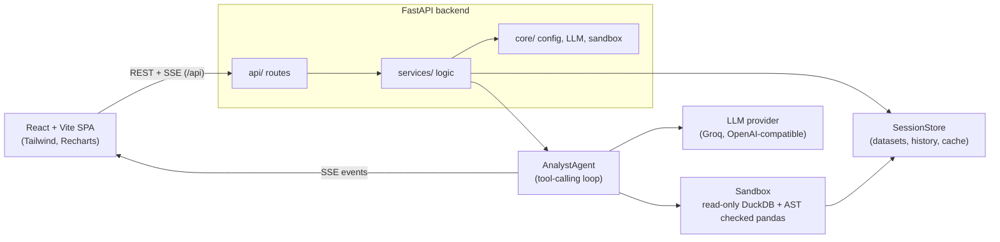
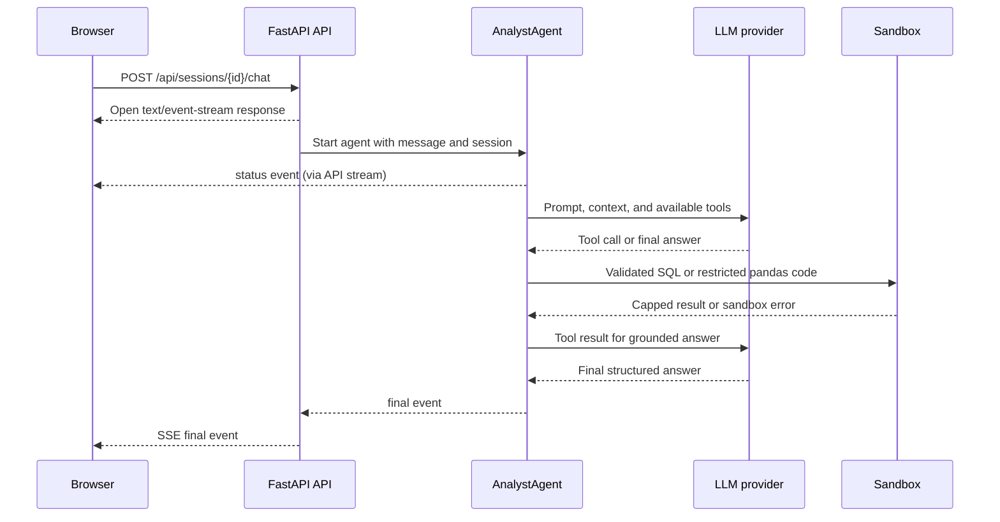

# DataPilot architecture

## Components

## One chat request

The synchronous `/chat/sync` route uses the same agent loop and returns JSON. In-memory
session state is local to one backend process.
